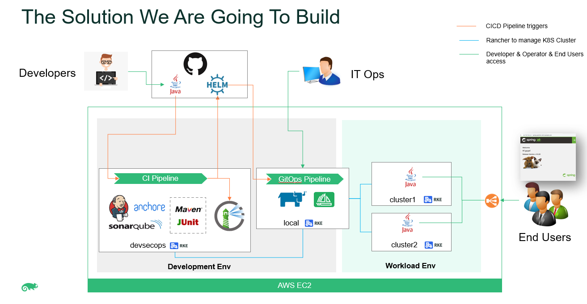

# Build Your Own DevSecOps using SUSE Rancher 2.6

This repository contains all the scripts and Kubernetes manifests for complimenting its hands-on workshop.

* [Part 1 - Initial Lab Setup on AWS Lightsail](./docs/part-1.md)
* [Part 2 - Configure GitHub & Jenkins](./docs/part-2.md)
* [Part 3 - Configure Jenkins Pipeline to deploy spring-petclinic App](./docs/part-3.md)
* [Part 4 - Rancher Continuous Delivery](./docs/part-4.md)
* [Part 5 - Put it all together](./docs/part-5.md)
* [Part 6 - Lab Clean Up](./docs/part-6.md)

# Background

This repo is the short version of SUSE DevSecOps Workshop:
https://github.com/dsohk/rancher-devsecops-workshop

The purpose of short version is to simplify the setup procedure for the workshop and make it easier to deliver the DevSecOps/CICD part, especially as an external activity such as a customer demo. Therefore the simplied steps are mainly in Part 1 and Part 2. 

Compare to the original version, the changes can be summarized:

- Shrink the lab size:
from 7 VM to 4 VM, and from 5 Clusters to 4 Clusters. 
The layout of lab is updated accordingly and shown in the scenario picture in the top of the README file.
In particular, the standalone cluster for Harbor is removed and Harbor is now placed into the devsecops cluster.
- Automate the manual config steps in Jenkins GUI, because those steps are most difficult to complete without a miss:
1. add credentials for GitHub and SonarQube.
2. add the Env Setting for Harbor.
3. add the Plugin settings for SonarQube.
- Remove the mannual steps to download the kubeconfig file of devsecops and copy/paste into Harbor VM. These steps are now automated as part of devsecops cluster setting.
- Combine the installation steps of Longhorn, Harbor, SonarQube, Anchore and Jenkins, so no need to execute the installation script for them one by one.

There are still some steps which have not been further scripted due to different considerations:

- It's infeasible to automate the Rancher UI operation for creating/importing RKE2 Cluster.
Till Rancher 2.6.3, creating/importing RKE cluster via Rancher API/CLI is not supported.
- It's infeasible to script the Jenkins setting for Anchore plugin, at lease by the study so far.
Anchore plugin setting is bound to use web GUI and cannot be automated by script or code.
- As workshop purpose includes to explain the CICD process, it probably is esaier to present during demo if the GitHub website operation (fork a project, setup token, edit the code) remain as GUI operation.
- The Jenkins job (Pipeline) operation (create / trigger build) is possible to script by Jenkins API. Currently it also remains as GUI operation for presentation at demo.

# References

* [Rancher Documentation](https://rancher.com/docs/)
* [Longhorn](https://longhorn.io/docs/1.1.1/)
* [Jenkins on Kubernetes](https://www.jenkins.io/doc/book/installing/kubernetes/)
* [Harbor Helm Chart](https://github.com/goharbor/harbor-helm)
* [Anchore Helm Chart](https://github.com/anchore/anchore-charts)
* [Deploy SonarQube on Kubernetes](https://docs.sonarqube.org/latest/setup/sonarqube-on-kubernetes/)

# Feedback

If you have any comments, suggestions or feedback to help improving this workshop, please feel free to reach out to our Team.

## Stay connected with
- Github Issues
- SUSE Community Group

