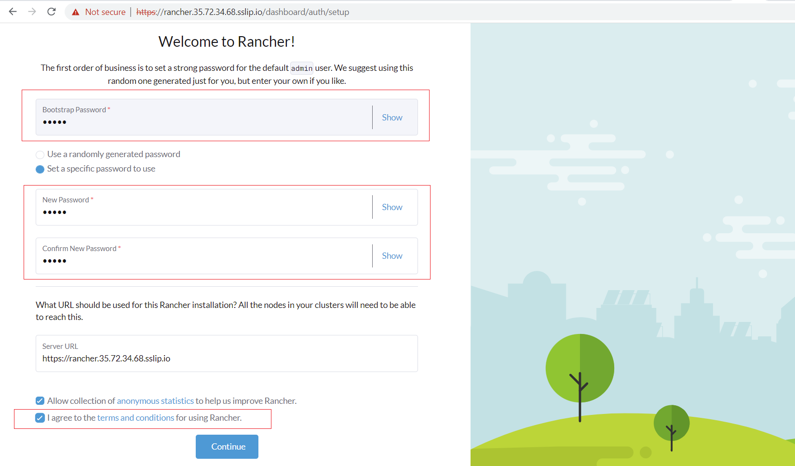
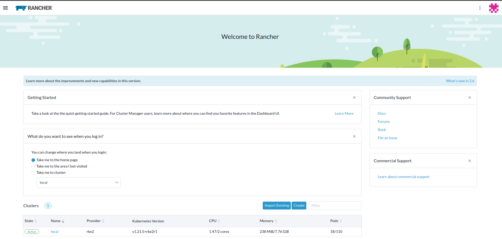
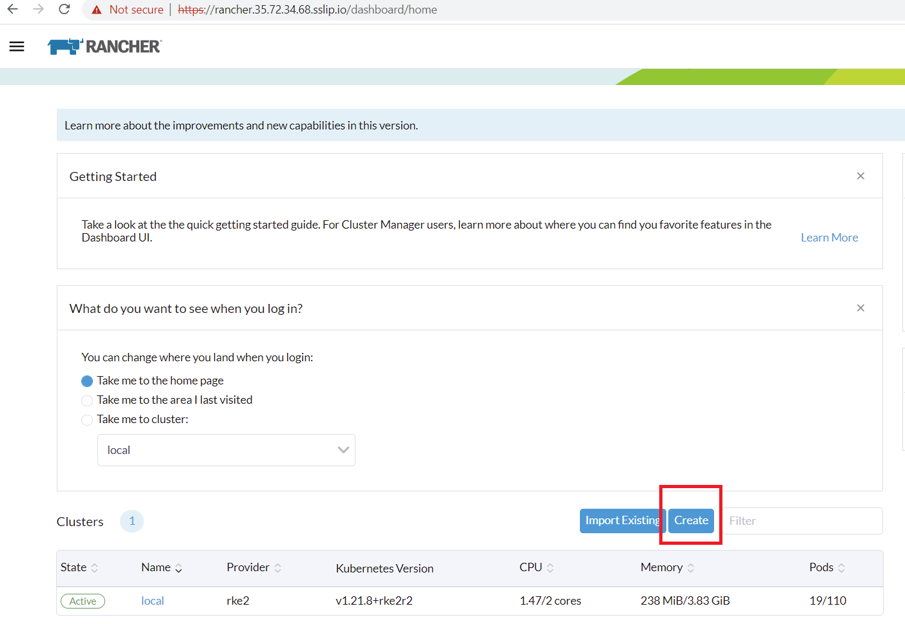
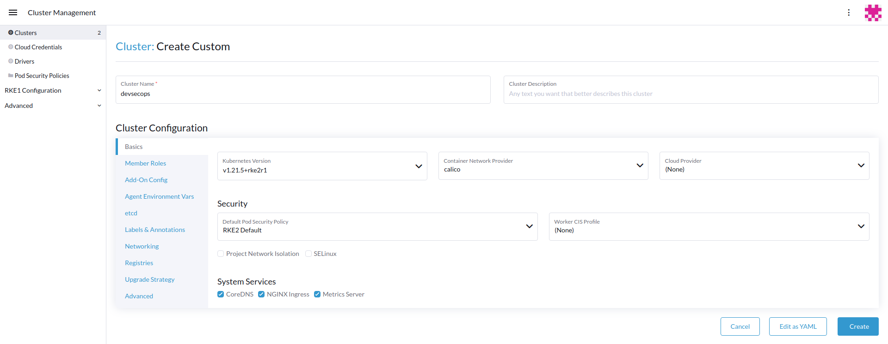
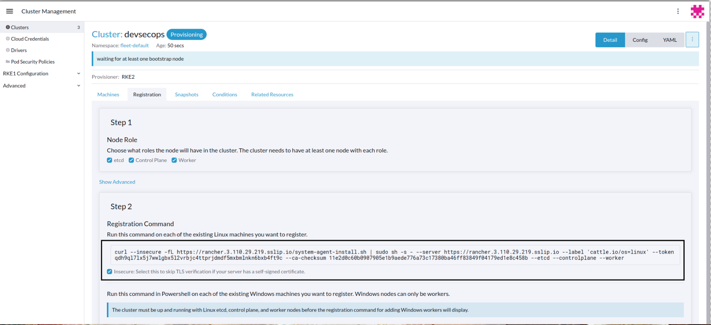
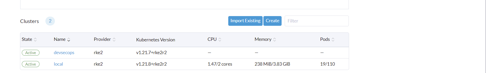
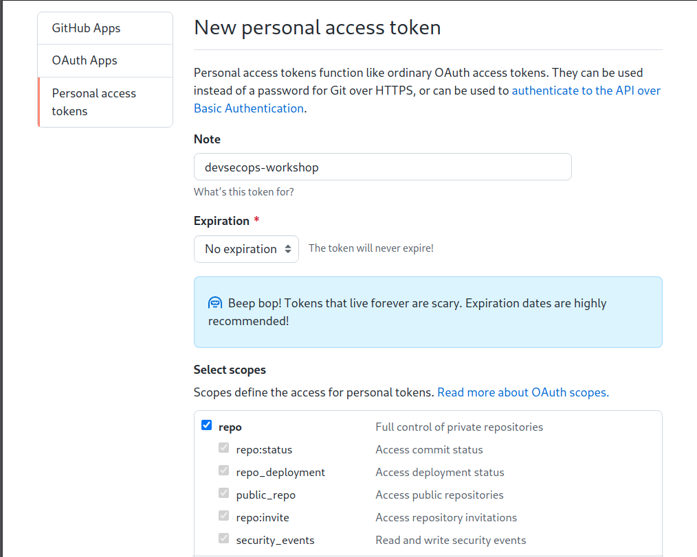
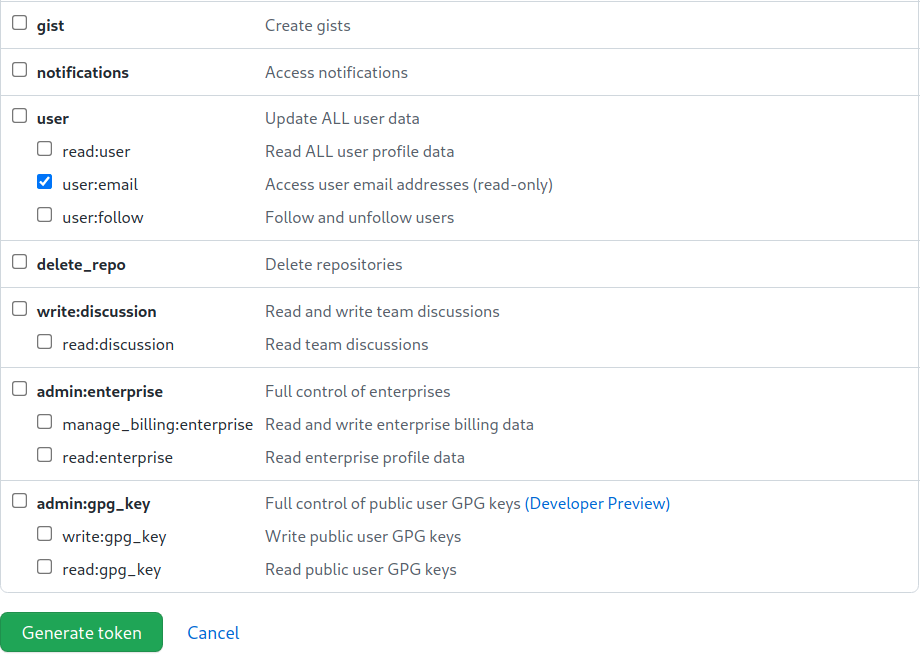
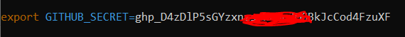

# Part 1 - Build Your Lab Environment on AWS Lightsail

This script will help you setup a lab environment with 4 VMs running on AWS Lightsail.

Estimated Completion Time: 30 mins

* Rancher Management Server v2.6.1 instance (1 VM)
* DevSecOps RKE2 cluster running `Harbor`, `Jenkins`, `Anchore`, and `SonarQube` (1 VM)
* 2 single-node RKE2-based clusters (1 VM each) for deploying applications.

## Pre-requisites

* Github account
* AWS account with AWS Lightsail full admin access
* Linux workstation with `git` and `aws` command line v2 installed and AWS credential key configured.


## To build the lab on AWS Lightsail

### 1. Clone Git Repository

1) In your linux terminal, create a folder for the workshop and  checkout this repository into a local folder.

```
mkdir workshop
```

```
git clone https://github.com/xiaojinse/rancher-devsecops-workshop-ShortVersion.git workshop
```

2) To view the content for the Cloned Repo, in your terminal execute below command
```
cd ~/workshop && ll 
```
you should see below sample outout. 
```
helen@SUSE-481694:~> cd ~/workshop && ll
total 44
-rwxr-xr-x 1 helen users  726 Jan 14 16:10 cleanlab.sh
drwxr-xr-x 5 helen users 4096 Jan 14 16:10 docs
-rw-r--r-- 1 helen users 1065 Jan 14 16:10 LICENSE
-rw-r--r-- 1 helen users 1215 Jan 14 16:10 README.md
drwxr-xr-x 4 helen users 4096 Jan 14 16:10 setup
-rwxr-xr-x 1 helen users 1083 Jan 14 16:10 setup-rke-cluster1.sh
-rwxr-xr-x 1 helen users 1081 Jan 14 16:10 setup-rke-cluster2.sh
-rwxr-xr-x 1 helen users 1198 Jan 14 16:10 setup-rke-devsecops.sh
-rwxr-xr-x 1 helen users 1160 Jan 14 16:10 show-my-lab-env.sh
-rwxr-xr-x 1 helen users 7428 Jan 14 16:10 startlab.sh
```

### 2. Deploy VMs on AWS Lightsail and Setup Rancher Management Server

Run the `startlab.sh --help` to get list of options. You should see the output like below.

```
❯ ./startlab.sh --help
  ___ _   _ ___ ___   ___              _
 / __| | | / __| __| | _ \__ _ _ _  __| |_  ___ _ _
 \__ \ |_| \__ \ _|  |   / _` | ' \/ _| ' \/ -_) '_|
 |___/\___/|___/___| |_|_\__,_|_||_\__|_||_\___|_|


Welcome to SUSE Rancher DevSecOps Hands-on Lab on AWS Lightsail ...
This script will help you to provision VMs on AWS Lightsail to get started to run your lab exercise. By default, this script will install Rancher for you after VM is up.

usage: ./startlab.sh [options]
-s    | --skip-rancher              Skip deploying Rancher after VM is up.
-h    | --help                      Brings up this menu

```

1) Run `startlab.sh` to deploy VMs on AWS Lightsail and automatically setup Rancher management server. It will prompt you which AWS region you would like to run your lab. 

```
./startlab.sh
```

2) You will be prompted to choose which AWS Environment and region you are going to run your lab environment.

```
dpatel@dns:~/workshop/rancher-devsecops-workshop> ./startlab.sh 
  ___ _   _ ___ ___   ___              _            
 / __| | | / __| __| | _ \__ _ _ _  __| |_  ___ _ _ 
 \__ \ |_| \__ \ _|  |   / _` | ' \/ _| ' \/ -_) '_|
 |___/\___/|___/___| |_|_\__,_|_||_\__|_||_\___|_|  
                                                    

Welcome to SUSE Rancher DevSecOps Hands-on Lab on AWS Lightsail ...
This script will help you to provision VMs on AWS Lightsail to get started to run your lab exercise. By default, this script will install Rancher for you after VM is up.

usage: ./startlab.sh [options]
-s    | --skip-rancher              Skip deploying Rancher after VM is up.
-h    | --help                      Brings up this menu

Checking pre-requisites...
git installed
awscli v2 installed

Select Your Preferred AWS Environment to run your lab:
1) US/Canada
2) Europe
3) Asia/Pacific
4) Quit
 3
Asia/Pacific
Select regions
1) Mumbai
2) Seoul
3) Singapore
4) Sydney
5) Tokyo
6) Quit
 5
You picked: Tokyo
Provisioning VM in your AWS Lightsail region ap-northeast-1 as lab environment ...
```

Choose the region closest to you to continue your lab setup. The script will then
a) Provision VMs on your AWS account with region you picked, 
b) Configure firewall rules for these VMs, 
c) Download AWS SSH keypair to your local folder to access to these VMs, and
d) Create shortcut files for you to access to the VMs in your lab environment.
e) Install Kubernetes tools (`Kubectl` & `helm`)
f) Deploy Rancher using Docker

#### Incase if you experience Error creating AWS Lighsail instance

Possible error `An error occurred (InvalidInputException) when calling the CreateInstances operation: We're sorry, your AWS account is pending verification. Please try again later`

Resolution - 
Perform cleanup by executing the below script. 
```
./cleanlab.sh
```
Post the cleanup re-run the startlab.sh script.

When the script has finished, you will see a table of VMs with IP addresses, the Rancher instance URL, and other useful files created in your local folder. For example, this is the extract of my output after running the startlab script.

*The IP addresses for you will be different from those in the screenshots in this lab guide.*

```
---------------------------------------------------------
Your Rancher Server is ready.

Your Rancher Server URL: https://rancher.35.72.34.68.sslip.io
Bootstrap Password: admin
---------------------------------------------------------
Your lab environment on AWS Lightsail ap-northeast-1 is ready.

Here's the list of VMs running in your lab environment (See file: mylab_vm_list.txt):
--------------------------------------------------------------------------
|                              GetInstances                              |
+--------------------+--------------------+-------------------+----------+
|       VMname       | privateIpAddress   |  publicIpAddress  |  state   |
+--------------------+--------------------+-------------------+----------+
|  suse0908-cluster2 |  172.26.22.100     |  54.178.109.244   |  running |
|  suse0908-cluster1 |  172.26.12.11      |  54.250.113.71    |  running |
|  suse0908-devsecops|  172.26.34.168     |  35.72.184.96     |  running |
|  suse0908-rancher  |  172.26.36.153     |  35.72.34.68      |  running |
+--------------------+--------------------+-------------------+----------+
To SSH into the VM on the lab, you can run this command:

./ssh-mylab-<vm>.sh

```
3) Open the Rancher URL in a browser window. This may take few mins to get Rancher Instance up and running. 

4) Toggle back to the terminal and execute the below command to see the list of files (text and scripts).

```
ls -lh 
```
Sample output below.

```

helen@SUSE-481694:~/devsecops> ll
total 220
-rwxr-xr-x 1 helen users    726 Jan  7 19:37 cleanlab.sh
drwxr-xr-x 5 helen users   4096 Jan 14 13:00 docs
-rw-r--r-- 1 helen users   1065 Jan  7 19:37 LICENSE
-rw-r--r-- 1 helen users     33 Jan 14 11:55 mylab_aws_region.sh
-rw------- 1 helen users   1676 Jan 14 11:08 mylab.key
-rw-r--r-- 1 helen users    381 Jan 14 11:08 mylab.pub
-rw-r--r-- 1 helen users     30 Jan 14 11:55 mylab_rancher_version.sh
-rw------- 1 helen users    386 Jan 14 11:08 mylab-ssh-config
-rw-r--r-- 1 helen users    783 Jan 14 11:08 mylab_vm_list.txt
-rw-r--r-- 1 helen users     26 Jan 14 11:55 mylab_vm_prefix.sh
-rw-r--r-- 1 helen users 134364 Jan 14 12:56 overview.png
-rw-r--r-- 1 helen users   1210 Jan  7 19:37 README.md
drwxr-xr-x 4 helen users   4096 Jan 11 14:55 setup
-rwxr-xr-x 1 helen users   1083 Jan 14 12:49 setup-rke-cluster1.sh
-rwxr-xr-x 1 helen users   1081 Jan 14 12:50 setup-rke-cluster2.sh
-rwxr-xr-x 1 helen users   1198 Jan 14 11:16 setup-rke-devsecops.sh
-rwxr-xr-x 1 helen users   1158 Jan 14 10:01 show-mylab-env.sh
-rwxr-xr-x 1 helen users     68 Jan 14 11:08 ssh-mylab-cluster1.sh
-rwxr-xr-x 1 helen users     68 Jan 14 11:08 ssh-mylab-cluster2.sh
-rwxr-xr-x 1 helen users     68 Jan 14 11:08 ssh-mylab-devsecops.sh
-rwxr-xr-x 1 helen users     67 Jan 14 11:08 ssh-mylab-rancher.sh
-rwxr-xr-x 1 helen users   7428 Jan 13 10:43 startlab.sh

```

You can access to any of your VMs with the `ssh-mylab-<VM>.sh` script. The IP addresses of your VMs are also captured in the file `mylab_vm_list.txt`

### 2. Provision DevSecOps RKE cluster from Rancher UI

In this step, we will provision the DevSecOps environment as a RKE cluster by using Rancher UI. 

a) Open browser to navigate to the Rancher URL captured in earlier step.

Sample output
```
Your Rancher Server URL: https://rancher.35.72.34.68.sslip.io
Bootstrap Password: admin
```
By pass the invalid SSL certificate warning, you should be prompted a `Welcome to Rancher` page. 
Provide the bootstrap password `admin` and setup your own administrative password  by selecting `Set a specific password to use`
Accept the Terms and Conditions



Finally you will be presented with the Rancher Homepage




b) Add `devsecops` cluster in Rancher. Navigated to Rancher Cluster Management UI. Click `Create` button. 



You will be presented `Cluster:Create` page. 

Under section `Provision a new node and create a cluster using RKE2/K3s (Tech Preview)`, toggle the switch `RKE2/k3s`. With Rancher 2.6 you can now provisoin RKE2 & K3s cluster via Rancher UI.

To create a new cluster choose the `custom` option to provision clusters on existing nodes 


b) You will be presented with `Cluster:Create Custom`form. Enter the cluster name as `devsecops` and leave the rest of the settings as default and click `Create` button. You will be presented with cluster registration command to create the RKE cluster on your VM. Check the box 'Insecure: Select this to skip TLS...'. 
Click on `registration command` to copy the command into your clipboard.





c) Open your Linux workstation terminal and switch to the working directory where this repo has been checked out. 

Run the script `./setup-rke-devsecops.sh` and paste the command you copied into the prompt from this script.

```
./setup-rke-devsecops.sh
```
```
❯ ./setup-rke-devsecops.sh
Enter Rancher registration command for devsecops cluster:
```
Sample output below
```
helen@SUSE-481694:~/workshop> ./setup-rke-devsecops.sh
Enter Rancher registration command for devsecops cluster:
curl --insecure -fL https://rancher.35.72.34.68.sslip.io/system-agent-install.sh | sudo  sh -s - --server https://rancher.35.72.34.68.sslip.io --label 'cattle.io/os=linux' --token r5g8qc2svglksrzr9g96nxxp2p6n8hlhlj4phzzkd2ctmggnrn5snl --ca-checksum 1d13e8d5f0de3b4f28677cbdc3843f1572ee380e0e36bcf144786acb5412158a --etcd --controlplane --worker

Registering devsecops as All-in-one RKE...
curl --insecure -fL https://rancher.35.72.34.68.sslip.io/system-agent-install.sh | sudo sh -s - --server https://rancher.35.72.34.68.sslip.io --label 'cattle.io/os=linux' --token r5g8qc2svglksrzr9g96nxxp2p6n8hlhlj4phzzkd2ctmggnrn5snl --ca-checksum 1d13e8d5f0de3b4f28677cbdc3843f1572ee380e0e36bcf144786acb5412158a --node-name devsecops --address 35.72.184.96 --internal-address 172.26.34.168 --etcd --controlplane --worker
  % Total    % Received % Xferd  Average Speed   Time    Time     Time  Current
                                 Dload  Upload   Total   Spent    Left  Speed
100 23771    0 23771    0     0   142k      0 --:--:-- --:--:-- --:--:--  142k
[INFO]  Label: cattle.io/os=linux
[INFO]  Role requested: etcd
[INFO]  Role requested: controlplane
[INFO]  Role requested: worker
[INFO]  Using default agent configuration directory /etc/rancher/agent
[INFO]  Using default agent var directory /var/lib/rancher/agent
[INFO]  Determined CA is necessary to connect to Rancher
[INFO]  Successfully downloaded CA certificate
[INFO]  Value from https://rancher.35.72.34.68.sslip.io/cacerts is an x509 certificate
[INFO]  Successfully tested Rancher connection
[INFO]  Downloading rancher-system-agent from https://rancher.35.72.34.68.sslip.io/assets/rancher-system-agent-amd64
[INFO]  Successfully downloaded the rancher-system-agent binary.
[INFO]  Generating Cattle ID
[INFO]  Successfully downloaded Rancher connection information
[INFO]  systemd: Creating service file
[INFO]  Creating environment file /etc/systemd/system/rancher-system-agent.env
[INFO]  Enabling rancher-system-agent.service
Created symlink /etc/systemd/system/multi-user.target.wants/rancher-system-agent.service → /etc/systemd/system/rancher-system-agent.service.
[INFO]  Starting/restarting rancher-system-agent.service

The devsecops cluster is now being provisioned by Rancher. It may take a few minutes to complete.
Once it's ready, please install Longhorn on it. Thank you!
```

d) Return to your browser with Rancher UI, you should see the `devsecops` cluster is being initialized. It may take 5-10 minutes to complete the whole RKE cluster setup.

While the devsecops cluster is being provisioned, you can continue with step 5 for provisioning additional RKE clusters.




### 3. Setup application in DevSecOps environment: Harbor, Anchore, SonarQube and Jenkins. 

In this part, we will actually execute below tasks in devsecops VM. Most of them have been scripted.

Step 1. Install tools like kubectl and helm.

Step 2. Install Longhorn. It's needed to provide Persistent Volume for applications like Anchore, SonarQube and Jenkins.

Step 3. Install Anchore.

Step 4. Install SonarQube and automate necessary steps as:
- Change the initial password (mandatory to start using SonarQube).
- Create a token from SonarQube, so later, Jenkins can trigger the static code scanning with this token.
- Create a project in SonarQube.

Step 5. Setup a GitHub token in GitHub Website. (**Only this step is not scripted.**)

Step 6. Generate the config file for Jenkins installation. The config file will be updated with the generated GitHub token, SonarQube token & project name, Harbr access info.

Step 7. Install Jenkins.


#### 3.1 Execute the first script in devsecops vm
 
Login to your devsecops instance VM with SSH from your linux workstation.

```
./ssh-mylab-devsecops.sh
``` 
 
Sample output below indicates you are on devsecops VMs Terminal.

```
suse0908-devsecops ec2-user@ip-172-26-34-168:~>ll
total 16
-rwxr-xr-x 1 ec2-user users 533 Jan 14 07:37 99_start_devsecops_1.sh
-rwxr-xr-x 1 ec2-user users  88 Jan 14 07:37 99_start_devsecops_2.sh
drwxr-xr-x 2 ec2-user users   6 Mar  7  2020 bin
drwxr-xr-x 7 ec2-user users  83 Jan 14 07:37 devsecops
-rw-r--r-- 1 ec2-user users  22 Jan 14 07:37 mygithub.sh
-rw-r--r-- 1 ec2-user users 783 Jan 14 07:37 mylab_vm_list.txt
``` 
 
Run the script 99_start_devsecops_1.sh and it will complete the step 1 to step 4 as explained above.
```
./99_start_devsecops_1.sh
```

#### 3.2 Generate the GitHub Personal Access Token.
This is the step 5 as explained above, that in order to integrate Jenkins with your GitHub account, you have to generate your personal access token for this.

**If you already have a Personal Access Token, you can reuse it and MUST store it into `mygithub.sh` as the below step g).**

a) Login to your GitHub account

b) Under your avatar icon, pull down the menu and choose `Settings` menu item.

c) Choose `Developer Settings` menu on the left, choose `Personal Access Tokens`

d) Click `Generate new token` button.

e) Enter `workshop` (or whatever you like) in the name field.

f) Choose `repo` and `user:email` in the privieged for this token.






g) Save and record down the generated token in the `mygithub.sh` file for configuring CI Pipeline in Jenkins later.

```
suse0908-devsecops ec2-user@ip-172-26-16-224:~>vim mygithub.sh
```
And paste your token as the value to env var GITHUB_SECRET.



#### 3.3 Execute the second script in devsecops vm

Run the script 99_start_devsecops_2.sh and it will complete the step 6 to step 7 as explained above.
```
./99_start_devsecops_2.sh
```

Please be aware that the installation will take time which varys due to your lab environment status.

* Longhorn (approx 5 mins)
* Harbor (approx 10 mins)
* Anchore (approx 3/4 mins)
* Sonarqube (approx < 6 mins)
* Jenkins (approx 5 mins)


With this, we have successfully completed all required steps in Part 1. We are ready to move to the Part 2 [Step 2 - Configure GitHub and Jenkins](part-2.md)

