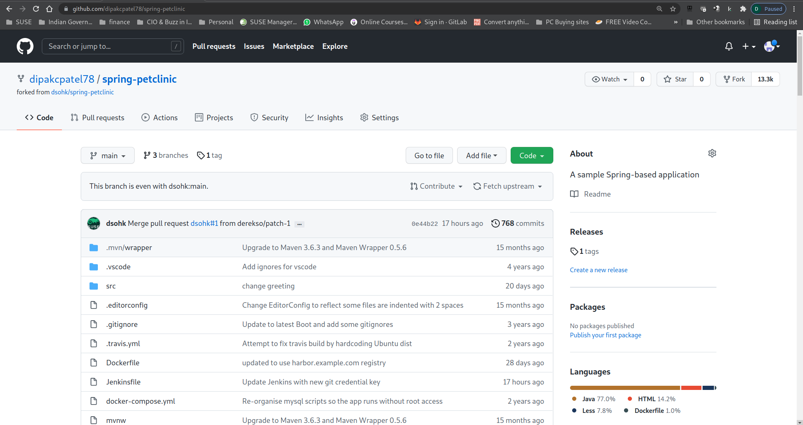
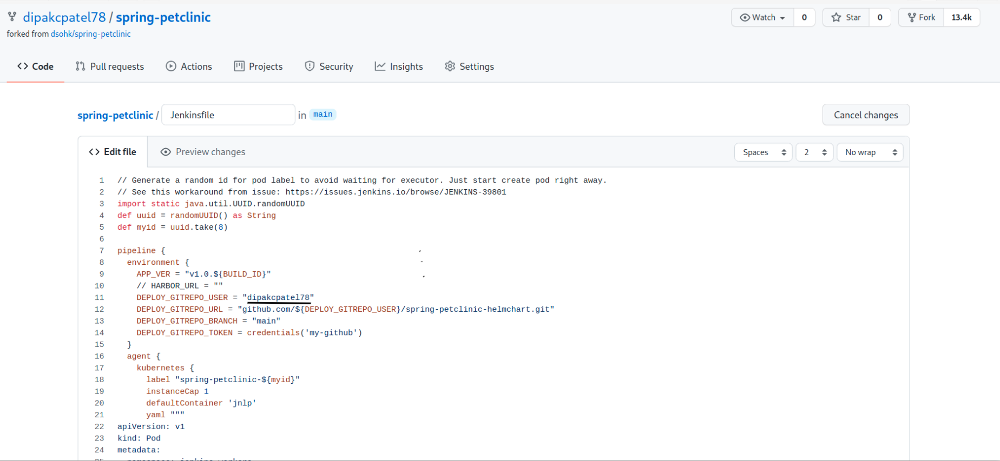
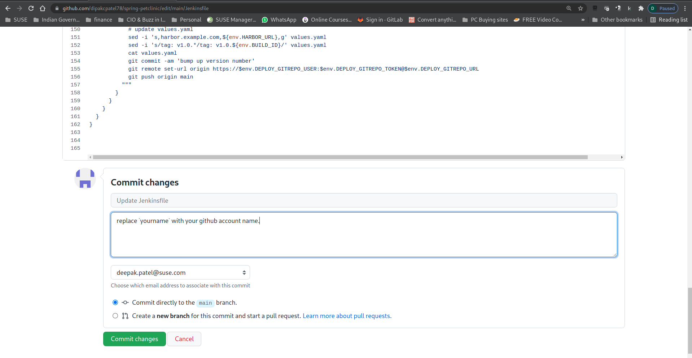
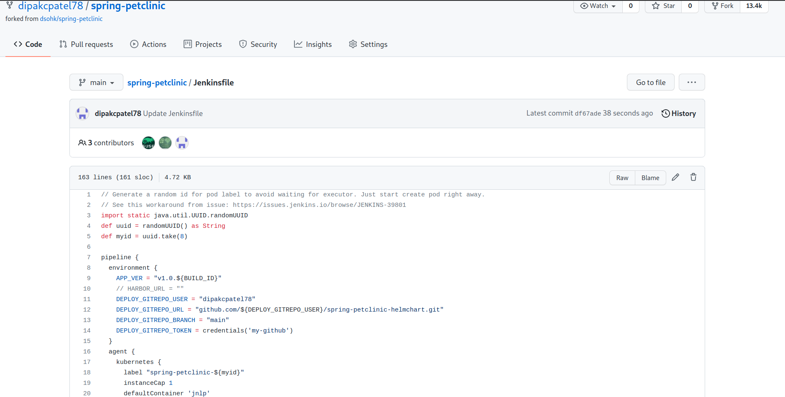
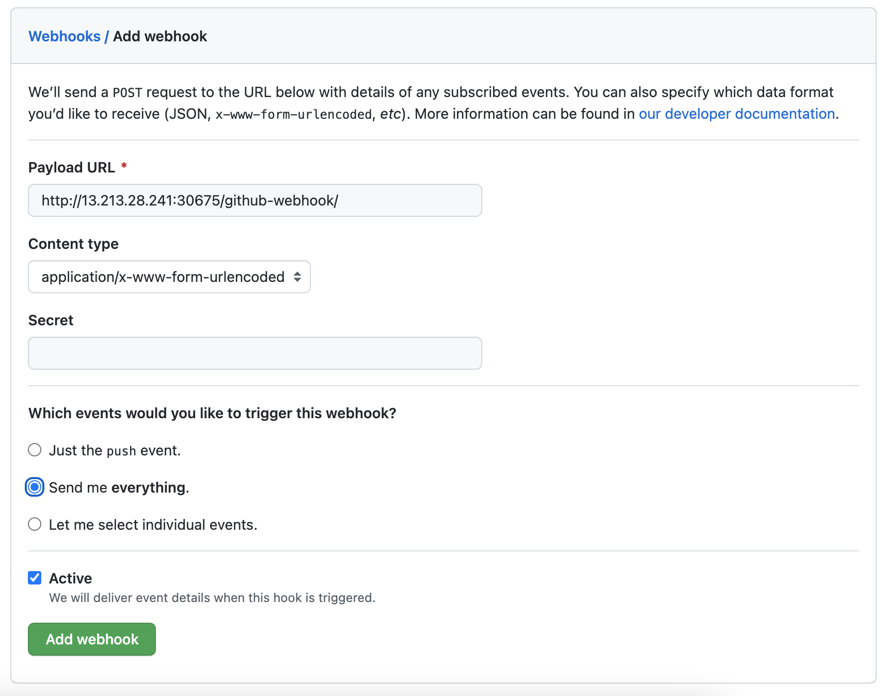
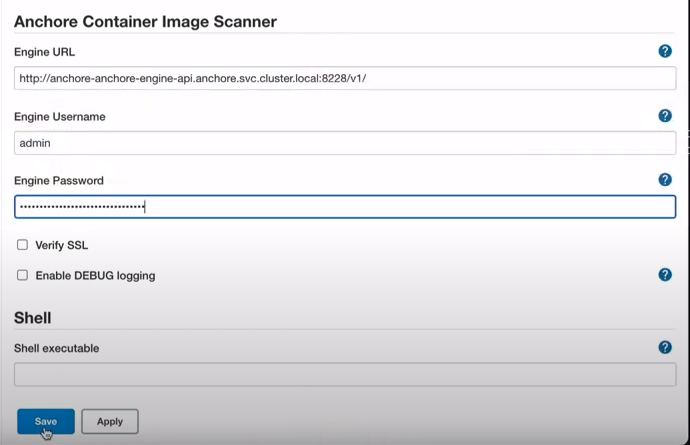

# Part 2 - Configure GitHub & Jenkins 


## 1. View lab enviroment.

Before we begin to configure Github & Jenkins, let's look at our lab environment.

NOTE: Make sure Jenkins, Anchore, and Sonarqube installation has been completed as per final step of Part 1.

1) Ensure you are on your local workstation/machine Terminal where we have our git repo cloned.

2) Run the command below to show your current lab environment. This shows you all information you need to configure your Jenkins in this section.

```
./show-mylab-env.sh
```

Sample output below.

```
Your Rancher Server URL: https://rancher.54.199.45.14.sslip.io
Bootstrap Password: admin

My Harbor Instance ...
URL: https://18.179.27.149:30443
User: admin
Password: WjNzO39n1JmBnf5ik6YTdklSGiIiEc

Your Jenkins instance is ready ...
http://18.179.27.149:31672/login
Username: admin
Password: 5kSVag82C401imqWCXvtDP

Your Jenkins Github webhook Payload URL:
http://18.179.27.149:31672/github-webhook/

Your Anchore is now successfully provisioned.
URL: http://anchore-anchore-engine-api.anchore.svc.cluster.local:8228/v1/
User: admin
Password: aYtuKs6CO1BoEH3DwlhHNd4fZZCfETL0

Your Sonarqube instance is ready ...
http://18.179.27.149:32216/login
username: admin
initial password: admin
updated password: admin123
export SONARQUBE_URL=18.179.27.149:32216
export SONARQUBE_SECRET=59eeb6e6395e4b48078c87a4eb27317036a173e4
```

A file `mylab_env.txt` should also have created for you. 

You GitHub Personal Access Token shall not be shown to others.
So, you could decide whether to record it into the `mylab_env.txt`.

## 2. Prepare the GitHub repositories for CICD pipeline running.

In this workshop, we will use two GitHub repositories:

1) Source code repository for JAVA application: spring-petclinic.
```
https://github.com/dsohk/spring-petclinic
```
2) The helm repository for Helm package of spring-petclinic-helmchart

```
https://github.com/dsohk/spring-petclinic-helmchart
```

Both of the original repositories shall be forked into your own GitHub.

Moreover, the source code repository spring-clinic shall be configured with a correct jenkins file and webhook,
so later, Jenkins can run pipeline correctly for it.
 
### 2.1 Fork the Spring-Petclinic Project into your own Github Account

1) Open a new Browser & past the below link

```
https://github.com/dsohk/spring-petclinic
```

2) Click on `Fork` Icon on top right hand window pane & select your own account name. 

Sample Output below.




### 2.2 Adapt the Jenkinsfile of Spring-Petclinic

1) In GitHub, navigate to your forked repoistory `Spring-Petclinic`. 

2) Edit the Jenkinsfile

The only change to our Jenkins file is in `Line 11` to adapt to our worksop requirement.

In line 11, replace `your_name` with `your github account name`

Sample Output for reference.




Once the changes are made, scroll down to the bottom of the page & hit `Commit changes` 



3) Review your changes and see if it's applied successfully.
 



### 2.3 Create WebHook for Spring-Petclinic which will trigger the Jenkins pipeline each time new code commits.

Setup git webhook for **spring-petclinic** repo to your Jenkins server

a) Click `Settings` in your **spring-petclinic** github repo.

b) Choose `Webhooks` from the left menu.

c) Click `Add Webhook` button

d) Enter Your Jenkins Github webhook Payload URL:
http://<YOUR_JENKINS_IPADDRESS>:<YOUR_JENKINS_PORT>/github-webhook/ 

e) Choose `Send me everything` for events to trigger this webhook.

f) Click `Add Webhook` button.




### 2.4 Fork the Spring-Petclinic-Helmchart Project into your own Github Account

1) Open a new Browser & paste the below link

```
https://github.com/dsohk/spring-petclinic-helmchart
```
2) Click on Fork Icon on top right hand window pane & select your own account where the repo will be forked.


Till now, the GitHub repositories are ready to work with Jenkins.


## 3. Configure Jenkins 

Most of the Jenkins configuration has been automated by Jenkins Plugin: `Jenkins Configuration as Code`.
However, the Anchore part is not covered by the `Jenkins Configuration as Code` so we have to mannually setup it.

a) Open Jenkins URL in your browser and login.

b) Navigate to `Managing Jenkins` > `Configure System`, and Scroll down to Achore Container Image Scanner Section.

Provide Anchore URL & Credentials. 

a) Engine URL: (Your Anchore URL)

b) Engine Username: (Your Anchore username)

c) Engine Password: (Your Anchore password)



Finally click `Save` button to save all the Jenkins configuration settings.

With this, we are ready to move to the [Step 3 - Build Your Jenkins Pipelines to deploy Spring-Petclinic App](part-3.md)


